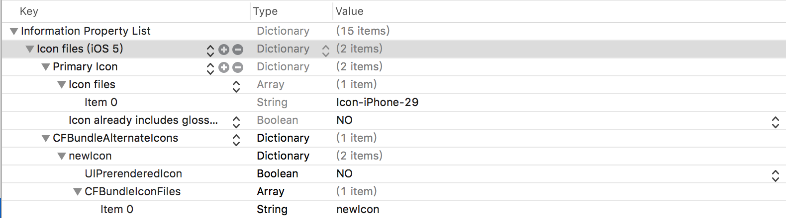

#替换应用icon

> [示例代码](https://github.com/tangdaoyong/Runtime)
> [参考链接](http://www.cocoachina.com/ios/20170428/19012.html)

iOS 10.3新增加了一个可以让开发者去更改应用图标的方法。

```Swift
open func setAlternateIconName(_ alternateIconName: String?, completionHandler: ((Error?) -> Swift.Void)? = nil)
```
调用前检查能不能更换图标

```Swift
if !UIApplication.shared.supportsAlternateIcons {
            print("不能更换图标")
            return
        }
        print("能够更换图标")
```
调用前获取现在使用的图标名字(如果是系统默认的则为nil)

```Swift
let iconName = UIApplication.shared.alternateIconName
```
调用时

```Swift
UIApplication.shared.setAlternateIconName("newIcon", completionHandler: { (error) in
            if error != nil {
                print("使用新图标错误")
                print(error!)
                return
            }
            print("使用新图标成功")
        })
```
如果要能够替换成功，需要配置plist文件:



